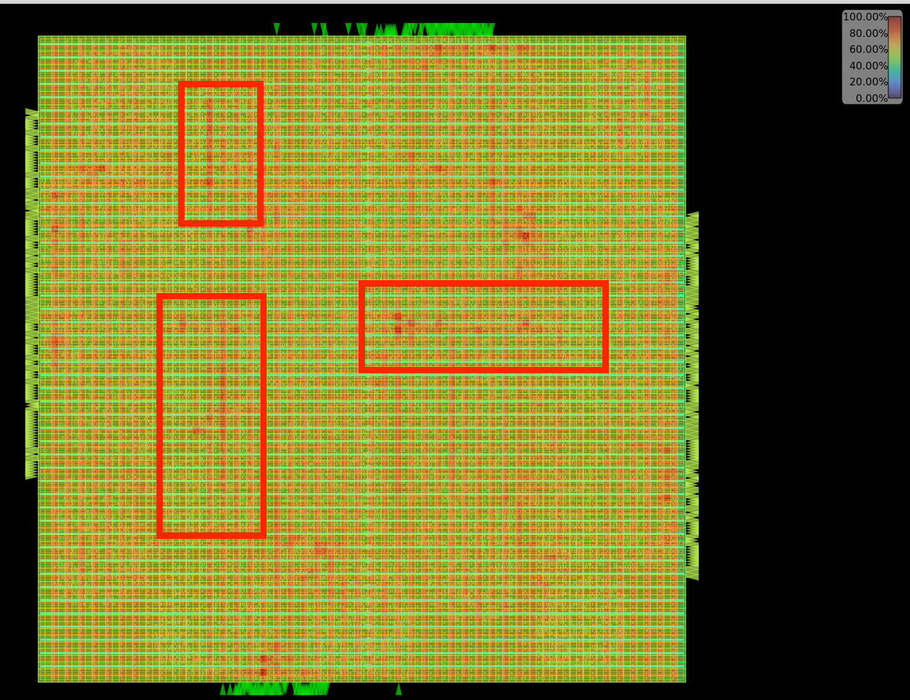
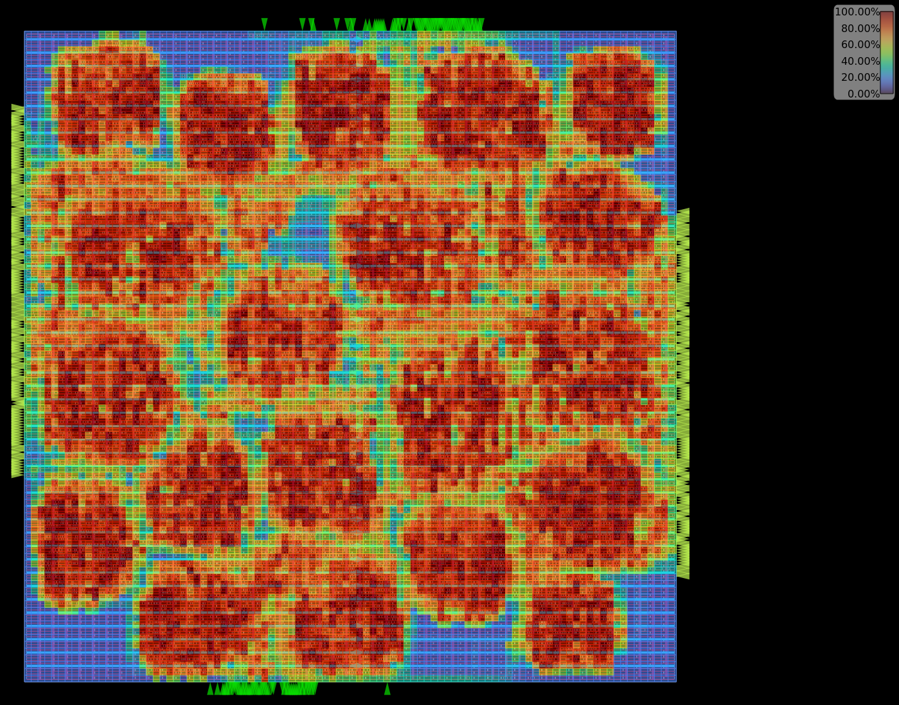

# Congestion Visualization

## CUGR vs. CUGR_AES (SKY130)
  

The left image shows the congestion heatmap for the baseCUGR algorithm while the right image is evolved `CUGR_AES` algorithm on AES design. The hotspots that `CUGR_AES` has managed to resolve are highlighted in red

## CUGR vs. CUGR_IBEX (SKY130)
  

The left image shows the congestion heatmap for the base CUGR algorithm while the right image is evolved `CUGR_IBEX` algorithm on IBEX design. The hotspots that `CUGR_IBEX` has managed to resolve are highlighted in red. 

## SPR vs. SPR_AES (SKY130)
  

The left image shows the congestion heatmap for the base SPRoute global routing algorithm. On the right side, we show `SPR_AES`. We can see that `SPR_AES` improves congestion across the entire design. 
