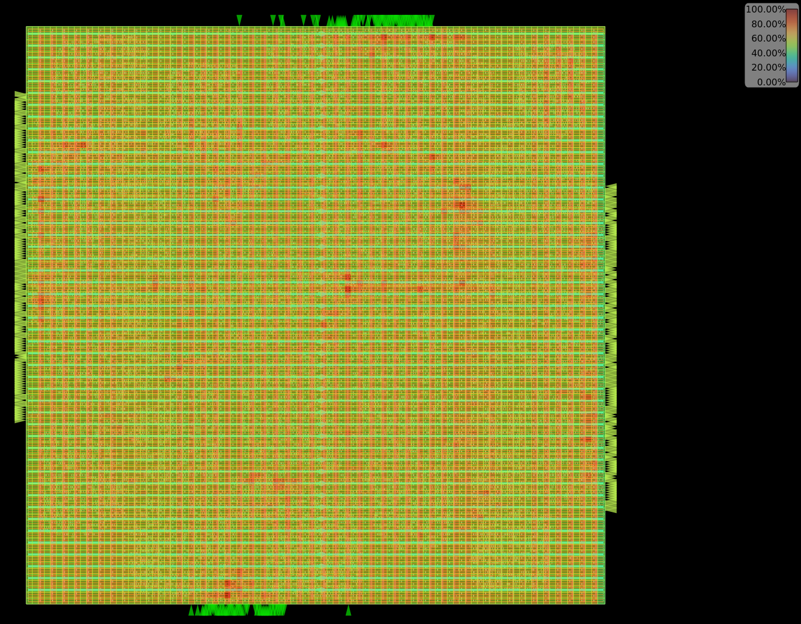
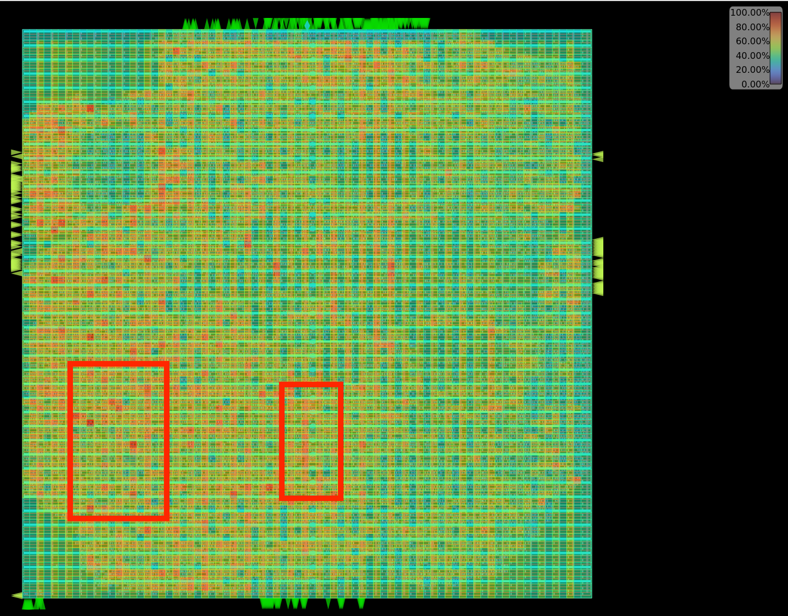
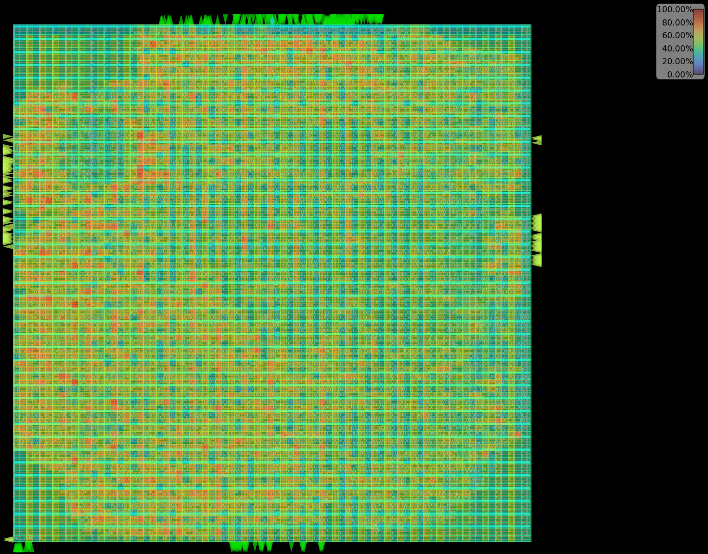
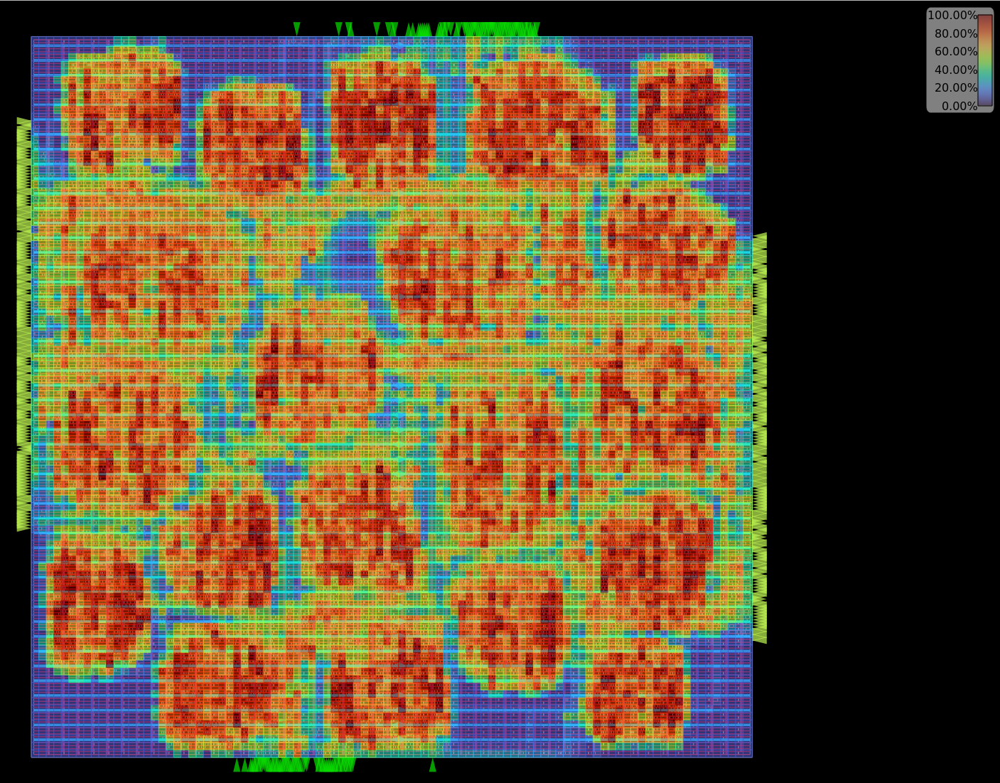

# Congestion Visualization

## CUGR vs. CUGR_AES 
  

The left image shows the congestion heatmap for the baseCUGR algorithm while the right image is evolved `CUGR_AES` algorithm on AES design. The hotspots that `CUGR_AES` has managed to resolve are highlighted in red

## CUGR vs. CUGR_IBEX 
  

The left image shows the congestion heatmap for the base CUGR algorithm while the right image is evolved `CUGR_IBEX` algorithm on IBEX design. The hotspots that `CUGR_IBEX` has managed to resolve are highlighted in red. 

## SPR vs. SPR_AES 
  

The left image shows the congestion heatmap for the base SPRoute global routing algorithm. On the right side, we show `SPR_AES`. We can see that `SPR_AES` improves congestion across the entire design. 

## Detailed Routing Congestion Metrics: 

| Design        | Wirelength Improvement | DR Runtime |
| ------------- | ---------------------- | ---------- |
| CUGR (AES)    | --                     | 321.9s     |
| SPRoute (AES) | --                     | 351.2s     |
| CUGR (IBEX)   | --                     | 1258.3s    |
| CUGR_AES      | +8.56%                 | 319.4s     |
| CUGR_IBEX     | +3.91%                 | 2975.8s    |
| SPR_AES       | +1.82%                 | 392.7s     |

