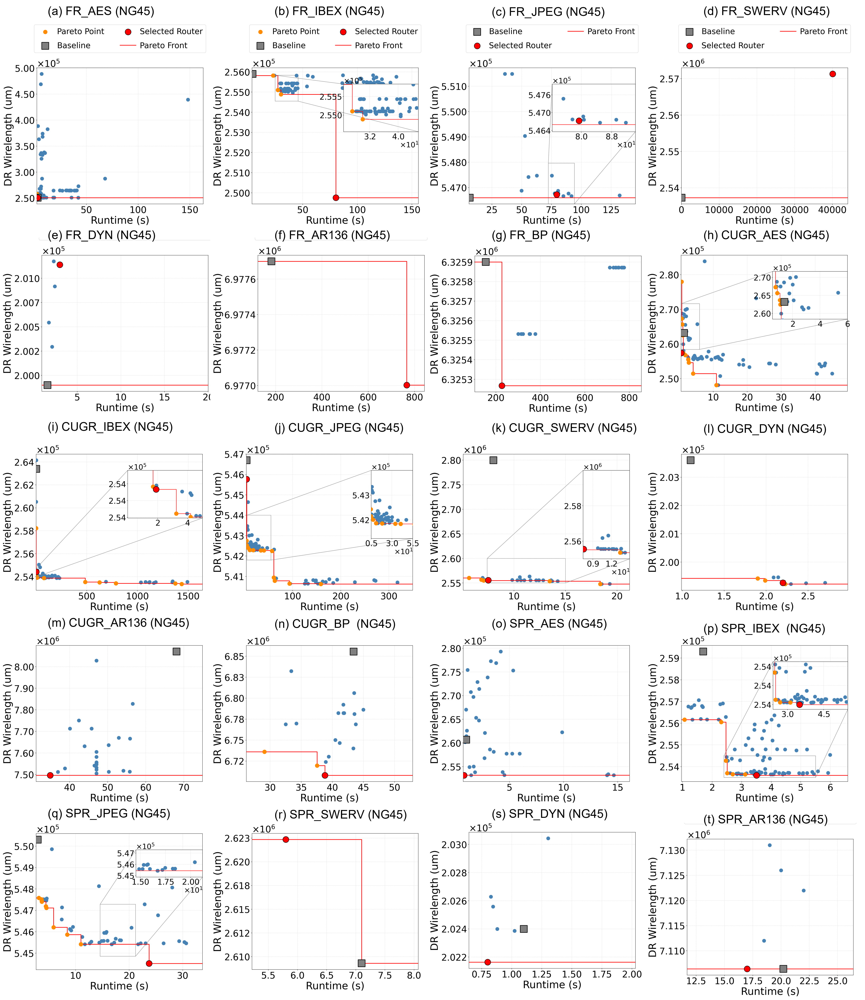
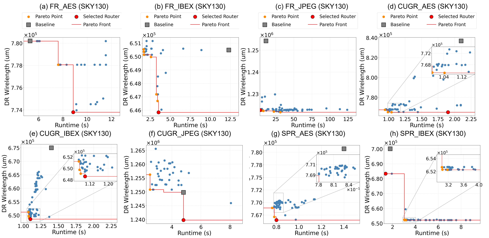

# Pareto Fronts for all evolved routers

1. [ASAP7](#evolution-pareto-fronts-for-asap7-pdk)
2. [NAN45](#evolution-pareto-fronts-for-nan45-pdk)
3. [SKY130](#evolution-pareto-fronts-for-sky130-pdk)

## Evolution pareto fronts for ASAP7 PDK

These pareto front images show Detailed Routing Wirelength vs. Global routing runtime. 

<!-- [ASAP7.pdf](./ASAP7.pdf) (original PDF) -->

## Evolution pareto fronts for NAN45 PDK

These pareto front images show Detailed Routing Wirelength vs. Global routing runtime. 

## Evolution pareto fronts for SKY130 PDK

These pareto front images show Detailed Routing Wirelength vs. Global routing runtime. 

